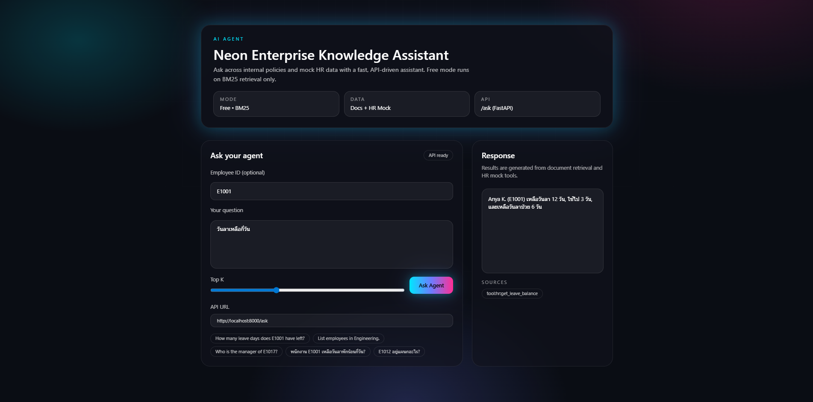

# AI Agent (Enterprise Knowledge Assistant)

## ภาษาไทย

### โปรเจกต์นี้คืออะไร
AI Agent เป็นระบบผู้ช่วยองค์กรสำหรับค้นหาและตอบคำถามจากความรู้ภายใน (Internal Knowledge) และข้อมูลพนักงานแบบจำลอง (Mock HR Data) โดยเน้นความโปร่งใสและใช้งานได้จริงในบริบทองค์กร

### สร้างมาทำไม
องค์กรมีข้อมูลกระจายอยู่หลายแหล่ง เช่น นโยบาย ขั้นตอนการทำงาน เอกสารคู่มือ และข้อมูล HR การค้นหาข้อมูลเหล่านี้ด้วยมือทำให้เสียเวลาและเกิดความผิดพลาด โปรเจกต์นี้ถูกสร้างขึ้นเพื่อทำให้การเข้าถึงข้อมูลเป็นเรื่องง่ายและรวดเร็ว

### แก้ปัญหาอะไรได้
- ลดเวลาค้นหาเอกสารและคำตอบที่เกี่ยวข้อง
- ลดข้อผิดพลาดจากการตีความข้อมูลด้วยมนุษย์
- ทำให้การตอบคำถามของทีม HR/IT/Operations เป็นมาตรฐานเดียวกัน
- รองรับคำถามเชิงธุรกิจจริง เช่น วันลาคงเหลือของพนักงาน หรือรายชื่อพนักงานตามแผนก

### เทคโนโลยี/AI ที่ใช้
- Retrieval: BM25 lexical search สำหรับค้นหาข้อมูลจากเอกสารแบบฟรี ไม่พึ่งพา API
- Mock Tools: ฟังก์ชันดึงข้อมูล HR จากไฟล์ `data/hr.json`
- Backend Logic: Python สำหรับ routing คำถามและตอบแบบ no-LLM
- UI: Streamlit สำหรับหน้าจอใช้งาน

### สรุป
โปรเจกต์นี้เป็นฐานของ Enterprise AI Agent ที่พร้อมต่อยอดไปสู่ LLM ในอนาคต โดยเริ่มจากระบบที่เชื่อถือได้ โปร่งใส และใช้งานได้จริงในต้นทุนต่ำ

---

## English

### What is this project?
AI Agent is an enterprise knowledge assistant that answers questions from internal documents and mock HR data. It focuses on transparency, reliability, and real-world enterprise usage.

### Why was it built?
Organizations store knowledge across policies, procedures, manuals, and HR datasets. Manual searching is slow and error-prone. This project streamlines information access to save time and reduce mistakes.

### What problems does it solve?
- Speeds up document discovery and Q&A
- Reduces human error from manual interpretation
- Standardizes HR/IT/Operations responses
- Supports real business questions (e.g., employee leave balance, department listings)

### AI/Tech stack
- Retrieval: BM25 lexical search for free, offline document retrieval
- Mock Tools: HR data access via `data/hr.json`
- Backend Logic: Python routing for no-LLM answering
- UI: Streamlit for the user interface

### Summary
This project serves as a strong foundation for an enterprise AI agent. It is designed to be transparent and cost-effective today, while remaining ready for LLM integration in the future.
