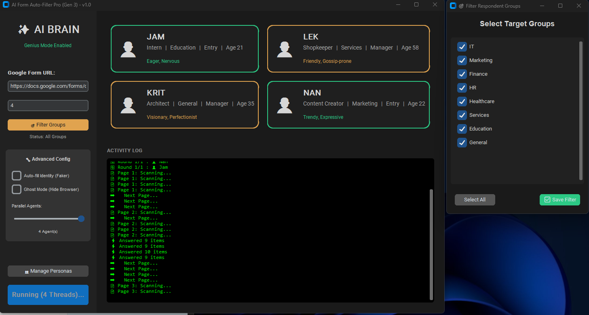

### AI Brain Auto Form

> ระบบ AI สำหรับประมวลผลแบบฟอร์มอัตโนมัติ

---

# 🧠 AI Brain - Intelligent Form Automation
**Advanced Persona-based Form Filler with Unsupervised Learning**

## 🇬🇧 English Description
**AI Brain** is a sophisticated automation tool designed to simulate human behavior in completing online forms (specifically Google Forms). Unlike standard bots, it uses a **Persona System** and **AI Clustering** to generate diverse, context-aware, and realistic responses.

### 🚀 Key Features
*   **Human-Like Simulation:** Mimics typing speed, hesitation, and smooth scrolling to bypass bot detection.
*   **Dynamic Personas:** Define agents with specific roles, ages, and interests (e.g., "Tech Lover", "Health Conscious").
*   **Smart Decision Making:** Uses K-Means clustering to understand form context and answer essentially.
*   **Standalone Application:** Compiled as a portable `.exe` (No Python required).
*   **Future-Proof:** Built-in integration layer for Gemini/GPT API.

---

## 🇹🇭 Thai Description (คำอธิบายภาษาไทย)
**AI Brain** คือโปรแกรมอัตโนมัติอัจฉริยะสำหรับช่วยกรอกแบบฟอร์มออนไลน์ (เช่น Google Forms) โดยมีความพิเศษที่ไม่ได้แค่สุ่มคำตอบ แต่ใช้ระบบ **Persona (บุคลิกภาพ)** และ **AI** ในการคิดวิเคราะห์คำตอบให้สมจริงที่สุด

### 🚀 ฟีเจอร์เด่น
*   **เนียนเหมือนคน:** มีระบบหน่วงเวลา, จำลองการพิมพ์ทีละตัวอักษร, และการเลื่อนหน้าจอที่นุ่มนวล (Stealth Mode)
*   **สร้างตัวละครได้:** กำหนดบทบาทของบอทได้หลากหลาย (เช่น สายไอที, สายสุขภาพ, ผู้สูงอายุ)
*   **คิดเองได้:** ใช้ AI เรียนรู้บริบทของคำถาม เพื่อเลือกคำตอบที่ตรงกับนิสัยของตัวละครนั้นๆ
*   **พร้อมใช้งาน:** รวมเป็นไฟล์ `.exe` ไฟล์เดียว เปิดใช้งานได้ทันทีไม่ต้องติดตั้งโปรแกรมเสริม
*   **รองรับอนาคต:** เตรียมระบบเชื่อมต่อกับ Gemini/GPT for ข้อความที่สร้างสรรค์กว่าเดิม

---
### 🛠 Technologies
*   **Language:** Python 3.13
*   **GUI:** CustomTkinter (Modern UI)
*   **Driver:** Selenium WebDriver
*   **AI Core:** Scikit-learn (K-Means), Numpy

*(Project by Thanarat-Int)*

