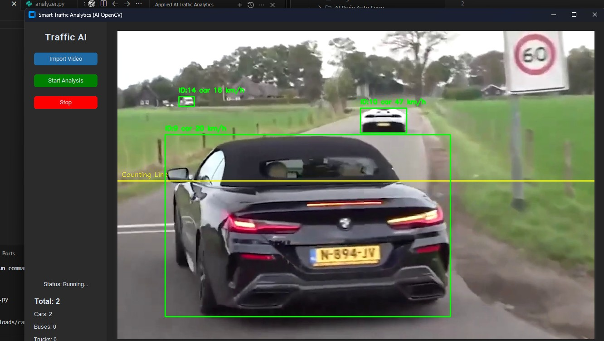

# 🚦 Smart Traffic Analytics System (Edge AI)



## 🇹🇭 เกี่ยวกับโปรเจกต์ (Project Overview)
ระบบวิเคราะห์การจราจรอัจฉริยะ (Smart Traffic Analytics) พัฒนาด้วย **Python** และ **YOLOv8** เพื่อจำลองการทำงานของระบบ **Edge AI** ที่ใช้ในงานจริง เช่น ร้านค้าปลีก (Retail) หรือ Smart City
ระบบนี้ถูกออกแบบให้รันบน **Edge Server** เพื่อรับภาพจากกล้อง CCTV ผ่าน RTSP และประมวลผลแบบ Real-time 24 ชม.

### ✨ ฟีเจอร์หลัก (Key Features)
- **Real-time Vehicle Detection**: ตรวจจับยานพาหนะ (รถยนต์, รถบัส, รถบรรทุก, มอเตอร์ไซค์) แม่นยำด้วย YOLOv8
- **ID Tracking**: ระบบติดตามรถคันเดิม (Tracking) ไม่นับซ้ำแม้มีการบดบัง
- **Counting Line Logic**: นับจำนวนรถเมื่อวิ่งผ่านเส้นที่กำหนด (แยกประเภทรถได้)
- **Speed Estimation**: คำนวณความเร็วโดยประมาณ (km/h) จากการเคลื่อนที่
- **Data Logging**: บันทึกสถิติลงไฟล์ CSV (Timestamp, ID, Type, Speed) เพื่อนำไปทำ Data Analytics ต่อ

### 🛠️ เทคโนโลยีที่ใช้ (Tech Stack)
- **Core AI**: YOLOv8 (Ultralytics), OpenCV
- **Algorithm**: ByteTrack / BoT-SORT for Tracking
- **GUI**: CustomTkinter (Modern UI)
- **Data**: Pandas / CSV Logging

---

## 🇬🇧 Project Description
A professional-grade **Smart Traffic Analytics System** aimed at **Applied AI Engineering**. This project demonstrates the capability to deploy Computer Vision models on Edge Servers for real-time monitoring.

### 🚀 Capabilities
1.  **High-Performance Detection**: Uses YOLOv8 Nano/Small models for low-latency inference suitable for Edge devices (e.g., NVIDIA Jetson, Edge Servers).
2.  **Business Logic Implementation**:
    - **Counting Line**: Validates counts only when vehicles cross a virtual line (mimicking toll gates or entry points).
    - **Speed Estimation**: Pixel-to-metric conversion logic to track vehicle speed.
3.  **Visualization & UX**:
    - User-friendly Dashboard using `CustomTkinter`.
    - Real-time visualization of bounding boxes, IDs, and speed.

### 🏗️ Architecture (Edge AI Scenario)
This software is designed to run on an on-premise **Edge Server (Linux/Ubuntu)** connected via LAN to CCTV cameras.
- **Input**: RTSP Stream from IP Cameras.
- **Processing**: Local GPU Inference (CUDA).
- **Output**: Real-time Dashboard (Monitor) & CSV Logs (Database).

## 💻 How to Run
1. Install dependencies:
   ```bash
   pip install ultralytics opencv-python customtkinter pillow
   ```
2. Run the application:
   ```bash
   python gui.py
   ```
3. Click **"Import Video"** to select a test file (e.g., `car.mp4`) or modify code to use RTSP URL.
