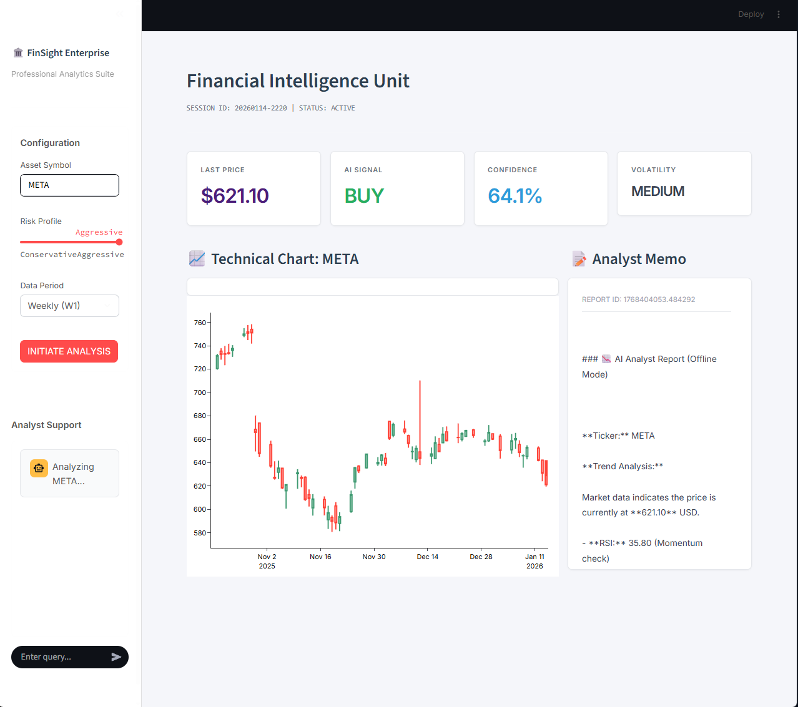

> ระบบ AI สำหรับประมวลผลแบบฟอร์มอัตโนมัติ

---

# 🏛️ FinSight Enterprise Project Presentation

## 1. บทนำ: FinSight คืออะไร? (Introduction)
**FinSight Enterprise** คือระบบ **"ปัญญาประดิษฐ์เพื่อการวิเคราะห์การลงทุน (Autonomous Financial Analyst Agent)"** ที่ถูกออกแบบมาเพื่อทำหน้าที่เสมือนเป็นผู้ช่วยนักวิเคราะห์ส่วนตัว (Personal Analyst) ที่ทำงานได้ตลอด 24 ชั่วโมง โดยผสานความแม่นยำทางคณิตศาสตร์เข้ากับความฉลาดในการให้เหตุผลของ AI

---

## 2. ทำไมต้องสร้างสิ่งนี้? ปัญหาและทางแก้ (Problem & Solution)

### ⚠️ ปัญหาเดิม (Pain Points):
*   **Information Overload:** ข้อมูลข่าวสารและตัวเลขในตลาดหุ้นมีมหาศาล มนุษย์ไม่สามารถอ่านและวิเคราะห์ได้ทันในเสี้ยววินาที
*   **Emotional Bias:** นักลงทุนมักใช้อารมณ์ (ความกลัว/ความโลภ) ในการตัดสินใจมากกว่าเหตุผล
*   **Time Consuming:** การวิเคราะห์หุ้น 1 ตัว ต้องใช้เวลาดูกราฟและอ่านข่าวนานหลายนาทีหรือเป็นชั่วโมง

### 💡 สิ่งที่ระบบนี้เข้ามาช่วย (Solution & Benefits):
*   **Instant Analysis:** วิเคราะห์หุ้นเสร็จภายใน 2-3 วินาที (จากเดิมเป็นชั่วโมง)
*   **Data-Driven 100%:** ตัดสินใจด้วยข้อมูลและสูตรคณิตศาสตร์ ตัดเรื่อง "อารมณ์" ออกไปได้ 100%
*   **Hybrid Intelligence:** ได้ทั้งความแม่นยำของ **Technical Analysis** (กราฟเทคนิค) และความเข้าใจบริบทของ **Fundamental Analysis** (ข่าวและเหตุผล)

---

## 3. เทคโนโลยีที่ใช้ (Technology Stack)

เราใช้ Tech Stack ที่ทันสมัยระดับ Enterprise Grade โดยหัวใจสำคัญคือการนำ **Generative AI** มาใช้งานจริง

*   **Core Engine:** Python (ภาษาหลักในการประมวลผลข้อมูล)
*   **Backend API:** **FastAPI** (ระบบหลังบ้านความเร็วสูง สำหรับรับส่งข้อมูล)
*   **Frontend UI:** **Streamlit** (หน้าจอดิสเพลย์สำหรับแสดงผลข้อมูลเชิงลึกและกราฟ)
*   **Data Visualization:** **Plotly** (ระบบกราฟ Interactive ระดับสูง)
*   **🧠 AI & Intelligence Layer (ไฮไลท์สำคัญ):**
    *   **Google Gemini (Large Language Model):** รับบทเป็น "Head Analyst" (หัวหน้าทีมวิเคราะห์) ทำหน้าที่อ่านรายงานทางเทคนิคและข่าวสาร แล้วเขียนสรุปคำแนะนำที่เป็นภาษาคน
    *   **Algorithmic Math (Pandas/NumPy):** รับบทเป็น "Data Scientist" คำนวณค่า RSI, MACD, Moving Average ด้วยสูตรคณิตศาสตร์ที่แม่นยำ

---

## 4. บทบาทของ AI ในโปรเจกต์นี้ (The Role of AI)

AI ใน FinSight ไม่ได้ทำหน้าที่แค่ "เดา" หรือ "คุยเล่น" แต่ทำหน้าที่เป็น **Synthesizer (ผู้สังเคราะห์ข้อมูล)**:

1.  **Contextual Understanding:** AI เข้าใจว่าค่า RSI ที่ 80 แปลว่า "Overbought" (คนแย่งกันซื้อมากไป) หรือข่าวที่เพิ่งออกมาเป็น "Positive" หรือ "Negative"
2.  **Reasoning:** AI จะหาเหตุผลว่าทำไมหุ้นตัวนี้ถึงน่าซื้อหรือน่าขาย โดยเชื่อมโยงระหว่าง "กราฟเทคนิค" กับ "ข่าวสารปัจจุบัน" เข้าด้วยกัน
3.  **Authentication:** ระบบใช้ AI ในการเขียนรายงานแบบ Professional Tone ทำให้ผู้ใช้งานได้รับข้อมูลที่กระชับ ตรงประเด็น และดูน่าเชื่อถือเหมือนอ่านงานวิจัยจากโบรกเกอร์ระดับโลก

---

## 5. หลักการทำงานเบื้องหลัง (How It Works)

ระบบทำงานแบบ **"Pipeline Architecture"** 4 ขั้นตอน ดังนี้:

### Step 1: หน่วยลาดตระเวน (Data Collection) 📡
ระบบจะส่ง Agent ออกไปดึงข้อมูลดิบจากแหล่งต่างๆ ทั่วโลกแบบ Real-time:
- **Market Data:** ดึงราคา open/high/low/close ย้อนหลัง 3-5 ปี
- **News Data:** กวาดหัวข้อข่าวล่าสุดที่เกี่ยวกับสินทรัพย์นั้นๆ จาก Google News RSS

### Step 2: หน่วยคำนวณ (Quantitative Processing) 📐
นำข้อมูลดิบเข้าสู่กระบวนการคำนวณทางคณิตศาสตร์ (Math Logic):
- คำนวณ Momentum (RSI)
- คำนวณ Trend (MACD, Moving Averages)
- ประเมินความเสี่ยง (Volatility)
- **ผลลัพธ์:** ได้ค่าสัญญาณซื้อ/ขาย (Signal: BUY/SELL) ที่เป็นตรรกะตายตัว 100%

### Step 3: หน่วยอัจฉริยะ (Generative AI Reasoning) 🧠
นำผลลัพธ์จาก Step 1 และ Step 2 ส่งให้ **Gemini AI** โดยใช้ Prompt Engineering ขั้นสูง:
- สั่งให้ AI สวมบทบาทเป็นผู้เชี่ยวชาญการเงิน
- ให้ AI อ่านค่าตัวเลขและข่าวทั้งหมด
- สั่งให้ AI เขียนสรุปวิเคราะห์แนวโน้มและคำแนะนำ
- **ผลลัพธ์:** ได้ "Analyst Memo" (บทวิเคราะห์) ที่มีที่มาที่ไปและเหตุผลรองรับ

### Step 4: หน่วยแสดงผล (Presentation) 🖥️
ระบบ **FinSight Enterprise Dashboard** จะนำข้อมูลทั้งหมดมาจัดเรียงบนหน้าจอ:
- แสดง **Signal** ตัวใหญ่ชัดเจน
- วาดกราฟ **Technical Chart** แบบ Clean Look (ไม่มี Grid กวนตา)
- แสดงบทวิเคราะห์จาก AI ในรูปแบบที่อ่านง่าย

---
**สรุป:** FinSight Enterprise คือการผสานพลังของ **"Logic (คณิตศาสตร์)"** เข้ากับ **"Magic (AI)"** เพื่อสร้างเครื่องมือการลงทุนที่ทรงพลัง แม่นยำ และใช้งานง่ายที่สุด
