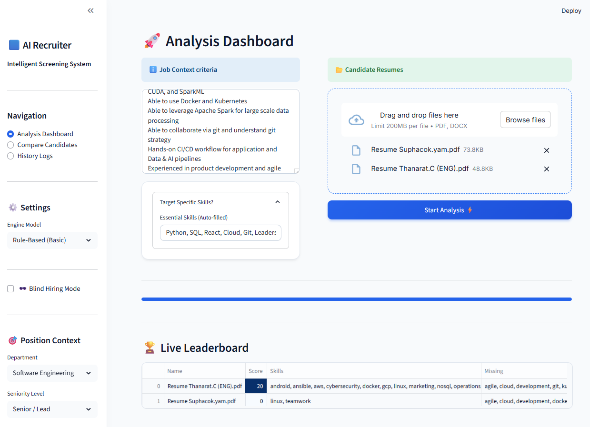
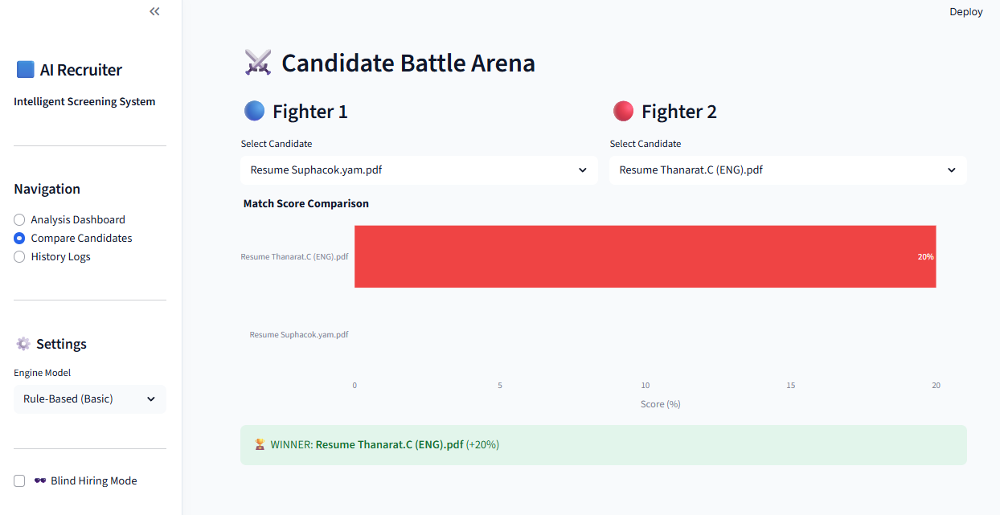
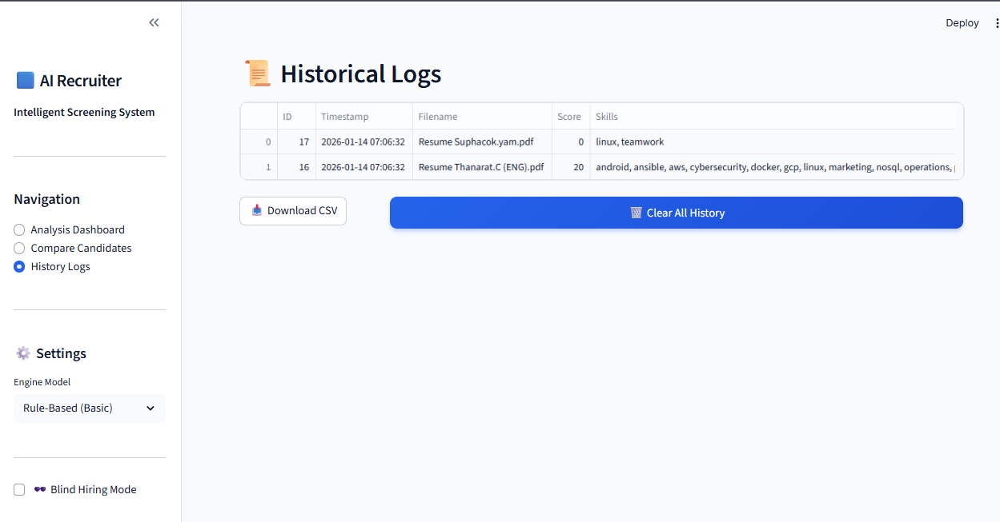

# 🤖 AI Recruiter

**AI Recruiter** is an intelligent resume screening and candidate analysis system powered by **Google Gemini LLM**. It helps HR teams automate the screening process, reduce bias with Blind Hiring, and make data-driven decisions.

## ✨ Key Features
- **Dual AI Engines**: Choose between High-Speed Rule-Based or Advanced LLM (Gemini) analysis.
- **Blind Hiring Mode**: Anonymize candidate data to reduce unconscious bias.
- **Candidate Battle Arena**: Compare two candidates side-by-side.
- **Auto-Generated Interviews**: Get tailored interview questions based on resume gaps.

---

> ระบบ AI สำหรับสแกนเรซูเม่ช่วย HR คัดกรองผู้สมัคร

---

---

---

### How to Use
1.  **Dashboard**:
    *   **Context**: Select Department & Seniority level from the sidebar.
    *   **Upload**: Paste the Job Description (JD) and drag & drop Resume PDFs.
    *   **Analyze**: Click "Start Analysis".
2.  **Comparison**: Go to "Compare Candidates" in the sidebar to view a head-to-head match.
3.  **History**: View past analysis logs and export data to CSV in the "History Logs" section.

---
